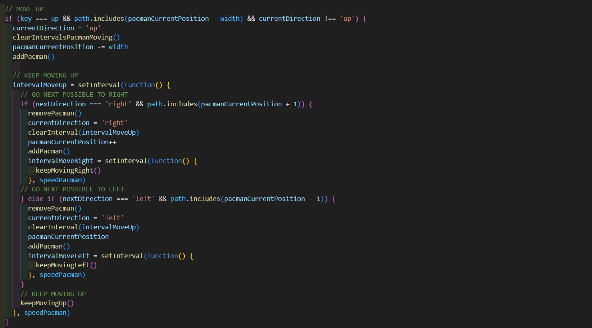

# PACMAN CLONE

## Description

Pac Man is a classic arcade game from the 80s. The player aims to eat all the food in a maze whilst being hunted by ghosts.

If the player eats special flashing food the ghosts start to flash and can now be captured by the player, sending them back to their holding pen, from where they can once again start to hunt the player.

The aim is to achieve the highest score possible before being killed by the ghosts.

## Deployment link

https://nadjaob.github.io/pacman/

## Timeframe & Working Team

This was a solo project which was planned, designed and built within one week. It's a unique version of pacman based on a 21x21 grid using JavaScript, HTML and CSS.

## Technologies used

### HTML

- Header section with text logo
- 3D button to start game
- Text overlay for countdown and score display
- Audio elements for background music and sound effects
- Volume icons to turn music on and off

### CSS

- Monospace font for easier designing of curved text logo
- Positioning of elements using flex-box
- Clean and consistent design throughout the whole game using box-shadow
- Different background images for characters depending on the mode of the game
- Rotation of pacman depending on direction

### JAVASCRIPT

- Dynamic grid creation
- Click Event to start and reset game anytime
- Click Event to turn on and off the sound
- setInterval to make characters keep moving in the same direction
- Different random and advanced pathfinder for ghosts
- Hunting mode to change conditions of game
- Display pop-ups

## Brief

### Your app must:

* **Render a game in the browser**
* **Be built on a grid: do not use HTML Canvas for this**
* **Design logic for winning** & **visually display which player won**
* **Include separate HTML / CSS / JavaScript files**
* Stick with **KISS (Keep It Simple Stupid)** and **DRY (Don't Repeat Yourself)** principles
* Use **Javascript** for **DOM manipulation**
* **Deploy your game online**, where the rest of the world can access it (we will do this together at the end of the project)
* Use **semantic markup** for HTML and CSS (adhere to best practices)

---

### Necessary Deliverables

* A **working game, built by you**, hosted somewhere on the internet
* A **link to your hosted working game** in the URL section of your Github repo
* A **git repository hosted on Github**, with a link to your hosted game, and frequent commits dating back to the very beginning of the project
* **A ``readme.md`` file** with explanations of the technologies used, the approach taken, installation instructions, unsolved problems, etc. (completed post project)

## Planning

I initially created a basic wireframe using Excalidraw, laying out the grid and designing the maze of my pacman game including two text overlays before and after the game. The wireframe is fairly simple and straight-forward, including the least necessary elements to play the game.

In addition to the wireframe I planned the whole game in an extensive pseudocode adding all mandatory features and a list of stretch goals. This pseudocode also guided me through the project and helped me with my time management.

## Build/Code Process

### Day 1

After the planning phase of this first project I built the HTML structure and did some research for possible designs.

### Day 2

After getting the idea of an old school 3D design I started implementing the CSS.

I also created the maze and possible paths using a JS based grid. I added images of my characters and defined their individual start position.

I added a keydown event listener to make pacman move and improved the navigation to make it as smooth and easy to use as possible. I practiced my problem-solving skills after facing problems of overlapping intervals and uncontrollable movements of pacman after pressing many keys quickly.

### Day 3

I created basic movement functions for the ghosts that selected a random direction at each junction. I spent some time fixing bugs of ghosts jumping between two adjacent positions and disappearing ghosts at the end of the tunnels. That's when I prevented the characters from reversing their movement and forbid entry to the tunnels.

I also added score counting and defined values for different achievements in the game.

### Day 4

I added a hunting mode which changes the conditions of the game. I also defined the end of the game when the player doesn't have any lives left or all dots have been eaten. The score will display with a text overlay. All intervals are cleared and the keydown event is removed so the board freezes.

### Day 5

I created another text overlay showing a countdown before the game starts and my first stretch goal of implementing background music and sound effects including a volume icon was hit.

### DAY 6

On the last day I devoted myself to the most difficult part of the project. I added an advanced pathfinder for ghost one and ghost four so they will always find a path towards pacman. Every time before a ghost moves, the current position of the ghost and the current position of pacman will be checked. I defined all possible conditions to find out if pacman is above left, above right, below right or below left. Depending on pacman’s location the ghost will check all available paths around and follow the algorithm to move into pacman’s direction.

### When the page loads

### When the game starts

The message 'Ready?' is followed by a countdown. After the pop-up disappears the characters appear in the maze and the ghosts start to leave their cage.

### When the ghosts move

Two of the ghosts follow a similar but not identical algorithm which checks their own position in relation to pacman's position before every step they take. To make it easier for the player the ghosts are not allowed to go through the tunnel. Usually they keep moving without turning around but there are a few exemptions like if the ghost and pacman are on the same horizontal or vertical level.

### When pacman moves

The navigation of pacman is designed to make the best user experience possible. When the player presses an arrow key pacman will keep moving until it hits a wall or dies. I set an interval in which I defined pacman’s speed. Before every movement it gets checked if there is a path in the chosen direction. As soon as another key is pressed pacman will keep moving and take the first possible turn into the new direction. The old interval is cleared and a new interval for the new direction is set. If pacman wants to move to the opposite direction the interval is cleared immediately and pacman moves into the new direction.

### When the game ends

## Challenges

- Overlapping intervals and timeouts which resulted in uncontrollable movements of pacman after pressing many keys quickly. It is important to clear intervals before setting a new one.
- Ghosts jumping between two adjacent positions and disappearing ghosts at the end of the tunnels. The paths have to be specified correctly, as well as the current positions of the characters so they can find their way.
- Understanding the positions of two characters in a grid. If-statements can be used to make a character follow a path towards the other character

## Wins

- My biggest win of this first project was creating the advanced pathfinder for the ghosts. I really enjoyed playing around with the algorithms and understanding better how coding works.
- A great feature for good usability is that pacman keeps moving after pressing an arrow key once. When the player sets a new direction it keeps moving until the next possible turn and then starts moving into the new direction which makes playing the game more fun and easy.
- The functionality of the buttons and keydown events are working smoothly and the game can be restarted at any time so that the best user experience possible is given.
- Another win is the clean and consistent design throughout the whole game.

## Key Learnings/Takeaways

- Setting and removing intervals and timeouts at the right time
- Implementing pop-ups using JavaScript
- Gained confidence in using DevTools
- Using rotations in CSS to define curved title
- Using rotations to change background images depending on current direction of pacman
- Importance of using global variables to implement different conditions into the game (eg to set hunting mode, to check current direction)

## Bugs

The game works smoothly and there are no obvious bugs.

Still there is room for optimization like stopping the ghosts from crossing paths. The consequence is that one ghost seems to disappear until they both separate their paths again.

## Future Improvements

- Recurring appearing fruits for extra score points
- Each ghost follows a unique algorithm
- Responsive design
- Persistent leaderboard
- Increasing difficulty throughout the levels